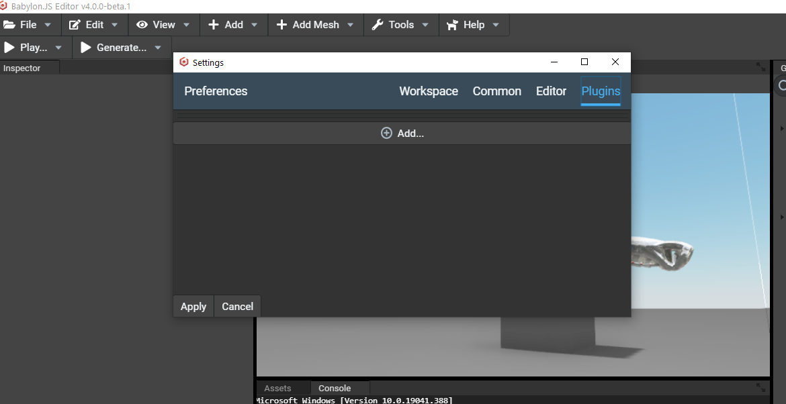
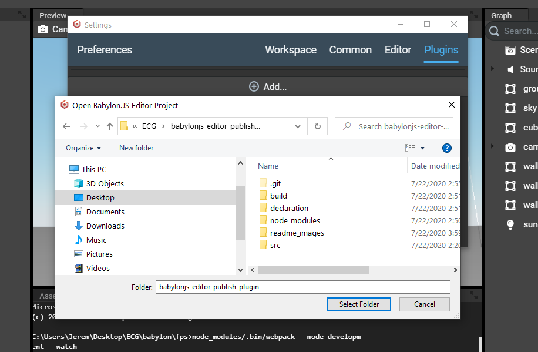
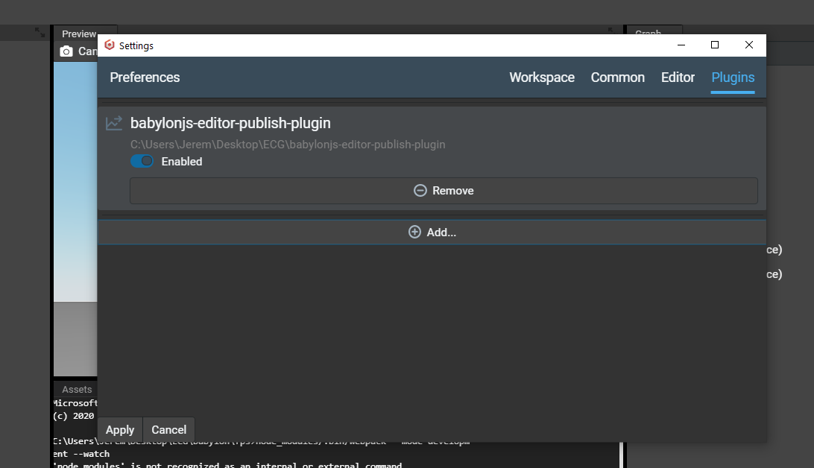
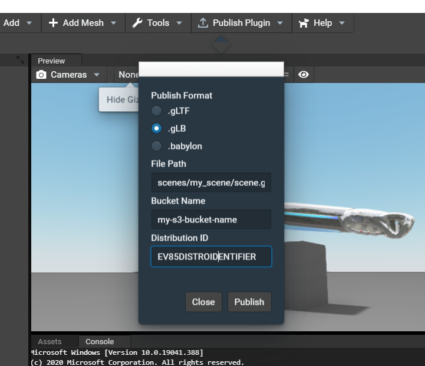
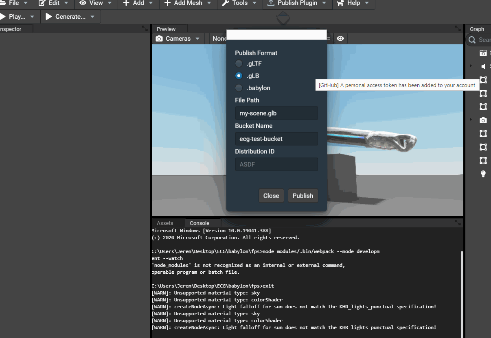
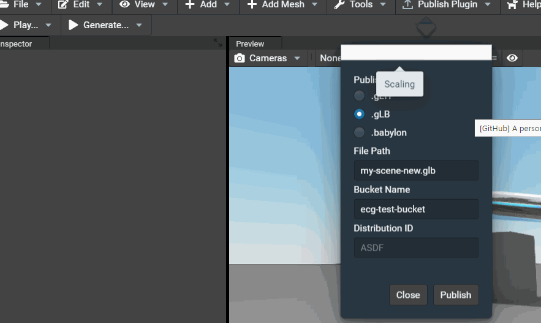

# babylonjs-editor-publish-plugin
a plugin to serialize the active scene and publish to a cloud provider (AWS currently supported)

# Setup AWS credentials

Start your shell and run `aws configure`. If AWS CLI is not installed (the command is not recognized), you will need to install it locally by following these instructions. Follow the instructions here https://docs.aws.amazon.com/cli/latest/userguide/install-cliv2.html depending on which operating system you are using. 

If `aws configure` is a recognized command, but there is no `default` profile setup, attempts to publish will fail. You will need to generate a set of AWS access keys through the AWS console, and use the generated values with the `aws configure` command.

# Install instructions

1. Clone the repository to your local machine:

`git clone https://github.com/electronic-caregiver/babylonjs-editor-publish-plugin.git`

2. Navigate to the directory in Powershell (or your preferred shell)

`cd ./babylonjs-editor-publish-plugin` 

3. Install the plugin dependencies

`npm install`

4. Compile the Typescript code into Javascript

`npm run compile`

(If this doesn't work, you may need to run `npm install -g tsc` and restart your shell)

# Load the plugin

Open the Babylon Editor, and open the Preferences tab (Edit > Preferences). Navigate to the Plugins tab.

Then navigate to the folder where the plugin was cloned and installed, and choose Select Folder.

Hit Apply. The plugin should now be loaded; if you go back to Edit > Preferences > Plugins, you should see the loaded plugin.

You can now enter the S3 bucket name, distribution ID (if using CloudFront), and object path. Hit publish and check the S3 bucket to see if your upload succeeded.

Finally, to save your preferences for the current workspace, save the project.

